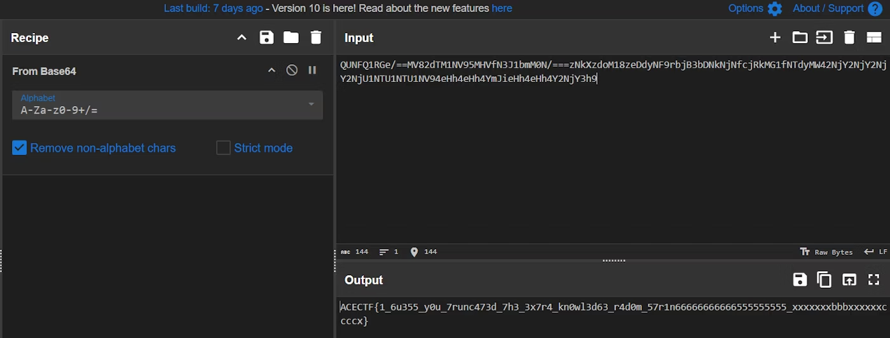

## A Little Extra Knowledge Is Too Dangerous

>Have you ever heard the quotes, A little knowledge is a dangerous thing and In the land of the blind, the one-eyed man is king? They strike me as deeply contradictory—one condemning the slightly knowledgeable, while the other exalts them.
This contradiction highlights something unsettling: fairness doesn’t seem to exist in this world. Everyone seems to twist things to suit their own agendas, leading to divisions—arbitrary ones—where people impose their ideologies on others.
What if we eliminated excess knowledge and these divisions altogether? Perhaps then we could live like illiterate cynics—but in peace.
That’s the essence of this challenge I’m presenting to you. Or should I call it a sermon?

```
chal.txt
QUNFQ1RGe/==MV82dTM1NV95MHVfN3J1bmM0N/===zNkXzdoM18zeDdyNF9rbjB3bDNkNjNfcjRkMG1fNTdyMW42NjY2NjY2NjY2NjU1NTU1NTU1NV94eHh4eHh4YmJieHh4eHh4Y2NjY3h9
```




base64で==つけたり外してみたりするとできた
`ACECTF{1_6u355_y0u_7runc473d_7h3_3x7r4_kn0wl3d63_r4d0m_57r1n66666666666555555555_xxxxxxxbbbxxxxxxccccx}`