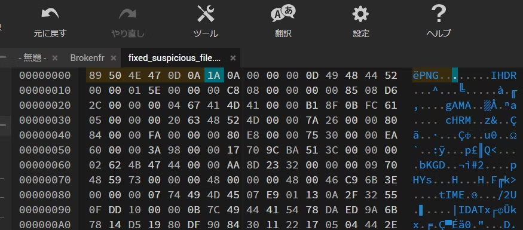

## Broken Secrets

>You’ve found a suspicious file, but it seems broken and cannot be opened normally. Your goal is to uncover its secrets.
Submit your answer in the following format: ACECTF{3x4mpl3_fl4g}

7-zipだとわかったので解凍して、中見るとnot_so_suspicious_fileというのもを見つけた

```
~/ctf/ace-ctf/forensic$ file Brokenfr
Brokenfr: 7-zip archive data, version 0.4
~/ctf/ace-ctf/forensic$ 7z l Brokenfr

7-Zip 23.01 (x64) : Copyright (c) 1999-2023 Igor Pavlov : 2023-06-20
 64-bit locale=C.UTF-8 Threads:12 OPEN_MAX:1024

Scanning the drive for archives:
1 file, 10240 bytes (10 KiB)

Listing archive: Brokenfr

--
Path = Brokenfr
Type = 7z
Physical Size = 10240
Headers Size = 451
Method = LZMA2:96k
Solid = +
Blocks = 1

   Date      Time    Attr         Size   Compressed  Name
------------------- ----- ------------ ------------  ------------------------
2025-01-20 00:38:03 D....            0            0  _
2025-01-20 00:38:03 D....            0            0  _/docProps
2025-01-20 00:38:03 D....            0            0  _/word
2025-01-20 00:49:37 D....            0            0  _/word/media
2025-01-20 00:38:03 D....            0            0  _/word/theme
2025-01-20 00:38:03 D....            0            0  _/word/_rels
2025-01-20 00:38:03 D....            0            0  _/_rels
1980-01-01 03:30:00 .....          709         9789  _/docProps/app.xml
1980-01-01 03:30:00 .....          759               _/docProps/core.xml
1980-01-01 03:30:00 .....         4010               _/word/document.xml
1980-01-01 03:30:00 .....         1833               _/word/fontTable.xml
2025-01-20 00:48:23 ....A         3209               _/word/media/not_so_suspicious_file
1980-01-01 03:30:00 .....         3330               _/word/settings.xml
1980-01-01 03:30:00 .....        42760               _/word/styles.xml
1980-01-01 03:30:00 .....         8399               _/word/theme/theme1.xml
1980-01-01 03:30:00 .....         1069               _/word/webSettings.xml
1980-01-01 03:30:00 .....          949               _/word/_rels/document.xml.rels
1980-01-01 03:30:00 .....         1362               _/[Content_Types].xml
1980-01-01 03:30:00 .....          590               _/_rels/.rels
------------------- ----- ------------ ------------  ------------------------
2025-01-20 00:49:37              68979         9789  12 files, 7 folders

```

破損しているようなので、PNGファイルの正しいヘッダーに直す
```
#16進数
89 50 4E 47 0D 0A 1A 0A
```


https://hexed.it/



.png拡張子つけて保存し、開いてみるとflagが出てきた


https://qiita-user-contents.imgix.net/https%3A%2F%2Fqiita-image-store.s3.ap-northeast-1.amazonaws.com%2F0%2F3959423%2F513d1aaf-39b7-4792-97b5-3403408172ea.png?ixlib=rb-4.0.0&auto=format&gif-q=60&q=75&w=1400&fit=max&s=164fec62b9e10ef7dae63d117d41a07f


`ACETF{h34d3r_15_k3y}`