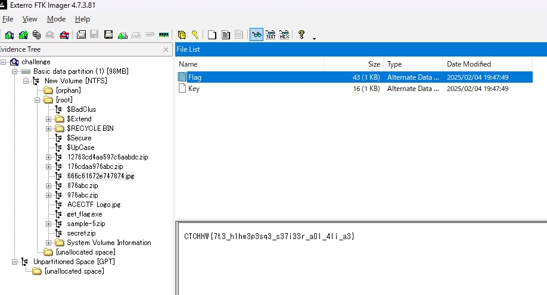
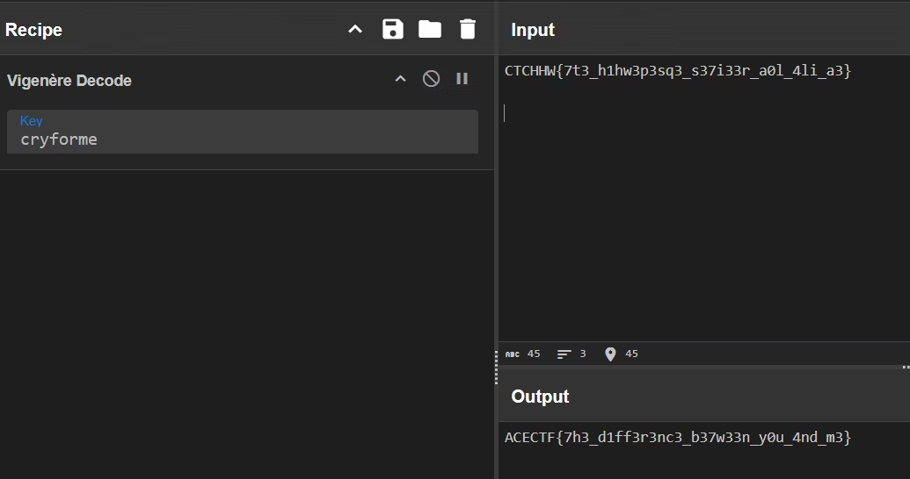

## Virtual Hard Disk

>One of the first things I learnt when I started learning to hack was linux. It was fun until I hit a ceiling of understanding about the differences in Operating Systems, what's a Shell, Kernel, etc.
But once I got better I started developing a liking towards the terminal and how the Linux operating system is better than say Windows, or worse in some cases. How none of them is superior, nor the other inferior. We shall find out with this challenge.
Be careful, a lot of fake galfs around.

```
┌──(kali㉿kali)-[/media/sf_vm_share/ctf/ace-ctf/forensic]
└─$ file challenge   
challenge: DOS/MBR boot sector MS-MBR Windows 7 english at offset 0x163 "Invalid partition table" at offset 0x17b "Error loading operating system" at offset 0x19a "Missing operating system"; partition 1 : ID=0xee, start-CHS (0x0,0,2), end-CHS (0xb,254,63), startsector 1, 4294967295 sectors
```
どうやらブートセクターです

>MBR（Master Boot Record）とは、ハードディスクなどのストレージ(外部記憶装置)の最も先頭にある、起動に必要なプログラムや情報を記録した小さな領域
コンピュータの起動時に実行される小さなプログラムで、オペレーティングシステム（OS）のブートローダーの場所を特定し、コンピュータを起動できるようにする

FTKImagerで開いて眺めてみるとflagとkeyのファイルを見つけた




ヴィジュネル暗号だと思い復号すると正しいflagになった





`ACECTF{7h3_d1ff3r3nc3_b37w33n_y0u_4nd_m3}`