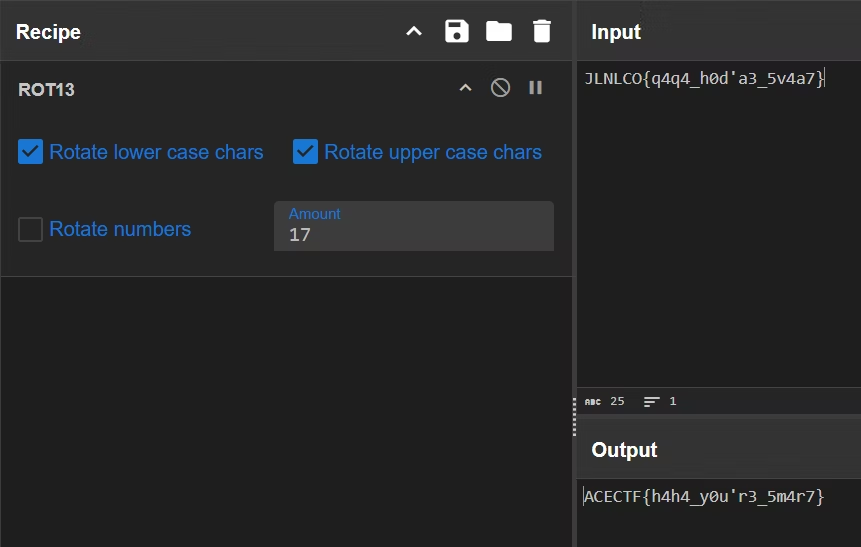

## Cryptic Pixels

This image looks normal at first, but something important is hidden inside. The secret is carefully concealed, making it hard to find.

Your task is to explore the image, uncover the hidden message, and reveal what’s concealed. Do you have what it takes to crack the code and unlock the secret?

Submit your answer in the following format: ACECTF{3x4mpl3_fl4g}

[**CrypticPixels.png**](https://acectf.tech/files/7db7c87b1aba00fd7cd4e59c8345b94b/CrypticPixels.png?token=eyJ1c2VyX2lkIjoxMTk3LCJ0ZWFtX2lkIjo2NjgsImZpbGVfaWQiOjUzfQ.Z8AcBw.4WoRFR5Q_7UvKcI2-_AyrBxsyGk)

binwalk -e CryticPixels.pngするとB8103.zipが手に入るが、パスワードがわからないのでzip2johnで辞書攻撃する

```
┌──(kali㉿kali)-[/media/sf_vm_share/ctf/ace-ctf/steg]
└─$ zip2john ./_CrypticPixels.png.extracted/B8103.zip > zip_hash.txt
ver 1.0 efh 5455 efh 7875 B8103.zip/flag.txt PKZIP Encr: 2b chk, TS_chk, cmplen=38, decmplen=26, crc=49DE1393 ts=1897 cs=1897 type=0
                                                                                                                                                                 
┌──(kali㉿kali)-[/media/sf_vm_share/ctf/ace-ctf/steg]
└─$ ls
CrypticPixels.png  _CrypticPixels.png.extracted  HeaderHijack.zip  Tabsspaces.zip  WhisperingWaves.zip  zip_hash.txt
                                                                                                                                                                 
┌──(kali㉿kali)-[/media/sf_vm_share/ctf/ace-ctf/steg]
└─$ john zip_hash.txt

Using default input encoding: UTF-8
Loaded 1 password hash (PKZIP [32/64])
Will run 2 OpenMP threads
Proceeding with single, rules:Single
Press 'q' or Ctrl-C to abort, almost any other key for status
Almost done: Processing the remaining buffered candidate passwords, if any.
Proceeding with wordlist:/usr/share/john/password.lst
qwertyuiop       (B8103.zip/flag.txt)     
1g 0:00:00:00 DONE 2/3 (2025-02-27 17:25) 7.142g/s 454628p/s 454628c/s 454628C/s 123456..Peter
Use the "--show" option to display all of the cracked passwords reliably
Session completed. 
```
qwertyuiopがパスワードと分かったのでこれを使う。flag.txtの中のflagをROT13すると正しいflagが手に入る




`ACECTF{h4h4_y0u'r3_5m4r7}`