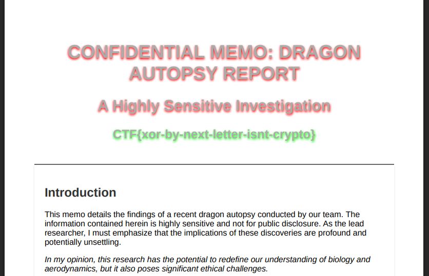

# obscuratron


We've obtained an encrypted document and the secret software used to encrypt it! But we can't find the decryption tool, can you figure out how to decrypt it?


obscuratronとmemo.pdf.encというファイルが与えられる

```
└─$ ./obscuratron                                                                           
OBSCURATRON

WARNING: RESTRICTED ACCESS FOR AUTHORIZED DRAGON GUARDIANS ONLY

This application is designed to securely encrypt sensitive dragon files, protecting them from
unauthorized access. All files encrypted with this tool are safeguarded with the highest level of
cryptographic security to ensure the confidentiality and integrity of dragon-related data.

USE OF THIS APPLICATION IS SUBJECT TO THE FOLLOWING TERMS:

Confidentiality: All encrypted data must be handled with utmost care to prevent unauthorized disclosure.

Security: Users are responsible for maintaining the security of their encryption keys and access credentials.

Compliance: Use of this application must comply with all relevant laws and regulations regarding data protection and encryption.

-=-=-=-=-=-=-=-=-=-=-=-=-=-=-=-=-=-=-=-=-=-=-=-=-=-=-=-=-=-=-=-=-=-=-=-=-=-=-=-=

Type your message and press ctrl-D to end!

Alternatively, use redirects: ./obscuratron < infile.pdf > outfile.pdf.enc
```

要約すると「このツールは、入力されたファイル（例：PDF）を暗号化して、.enc 付きのファイルに変換するためのコマンドラインアプリ」

モード1 : 自分でメッセージを入力して、Ctrl + D を押すと、それが暗号化されて出力されます（stdoutにバイナリが出力される
```
$ ./obscuratron
Type your message and press ctrl-D to end!
```

モード2 : infile.pdf を暗号化して outfile.pdf.enc を作れる
```
$ ./obscuratron < infile.pdf > outfile.pdf.enc
```

## solution

solve.py

```
key = 0xab
decrypted = bytearray()

with open("memo.pdf.enc", "rb") as f:
    encrypted = f.read()

for b in encrypted:
    decrypted_byte = b ^ key
    key = b
    decrypted.append(decrypted_byte)

with open("memo_decrypted.pdf", "wb") as f:
    f.write(decrypted)
```


復号したpdf




## flag

`CTF{xor-by-next-letter-isnt-crypto}`