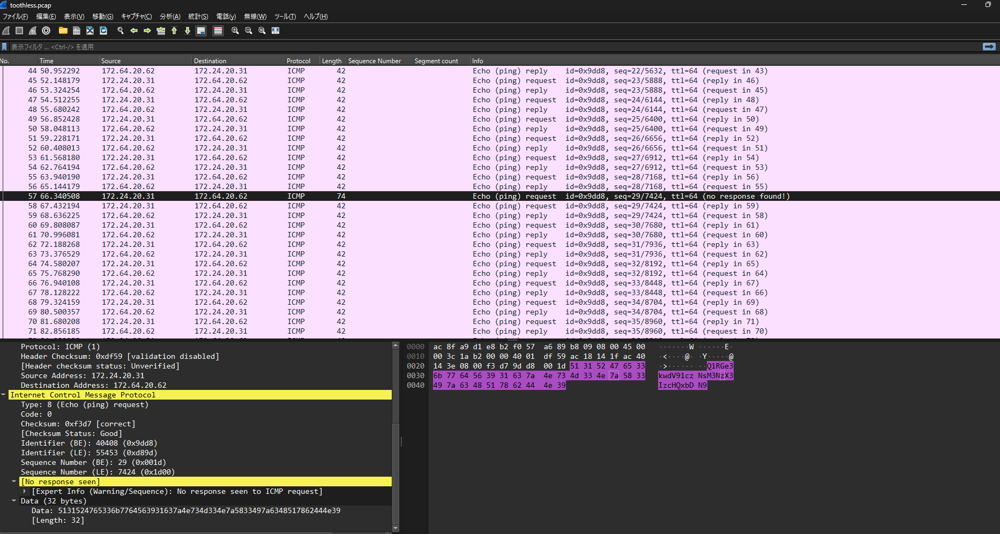
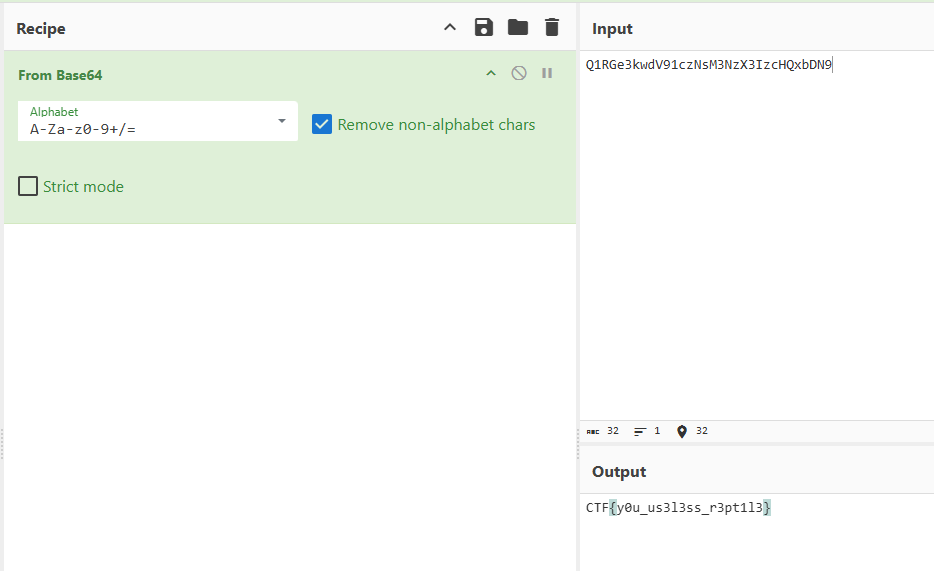

# toothless

This packet capture seems convoluted. Is it?

与えられたpcapの中に1つだけデータが入っている通信があった

`5131524765336b7764563931637a4e734d334e7a5833497a6348517862444e39`

HEXっぽいのでfrom HEXデコードすると`Q1RGe3kwdV91czNsM3NzX3IzcHQxbDN9`になる

これはbase64ぽいのでdecode base64するとflagが手に入る

## flag

`CTF{y0u_us3l3ss_r3pt1l3}`