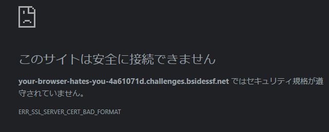

# your-browser-hates-you

We're pretty sure there's a flag on this page, but something is wrong with SSL and we can't get our browser to render it! Can you help?
(Note: you'll intentionally get an SSL error when you visit the page)

https://your-browser-hates-you-4a61071d.challenges.bsidessf.net


アクセスするとこのように表示される




## solution


SSL証明書がわざと壊れてる or 非標準な形式で出されてて、通常のブラウザでは見れないのでSSLをバイパスする

1. curlコマンド

-k オプションでSSL証明書無視して接続できる

```
$ curl -k https://your-browser-hates-you-4a61071d.challenges.bsidessf.net/
<!DOCTYPE html>
<html lang="en">
<head>
    <meta charset="UTF-8">
    <meta name="viewport" content="width=device-width, initial-scale=1.0">
    <title>The Lonely Dragon's Blog</title>
    <link rel="stylesheet" href="style.css">
</head>
<body>
    <header>
        <h1><font color="red">The Lonely Dragon's Blog</font></h1>
        <p><font color="blue">Where dragons lament about their website traffic</font></p>
        <p><font color="blue">Flag: CTF{shh-its-a-secret}</font></p>
    </header>

    <div class="row">
        <div class="leftcolumn">
            <div class="card">
                <h2><font color="purple">No Visitors in Sight</font></h2>
                <h5><font color="green">Posted on a lonely day, March 17, 2025</font></h5>
                <p><font color="black">It's been another day, and I've had zero visitors. I wonder if anyone even knows I exist. My scales are dull, my fire is weak, and my website is a ghost town. I've tried everything to attract some attention—posting about the latest dragon fashion trends, sharing recipes for dragon-sized meals, and even offering advice on how to properly hoard treasure. But nothing seems to work.</font></p>
                <p><font color="black">I've started to feel like I'm shouting into the void, with no one to hear my roar. The silence is deafening, and it's starting to get to me. I've begun questioning whether it's worth continuing to write if no one is going to read it.</font></p>
            </div>

            <div class="card">
                <h2><font color="orange">The Agony of Silence</font></h2>
                <h5><font color="pink">Posted on a silent night, March 15, 2025</font></h5>
                <p><font color="black">The silence is agonizing. No comments, no likes, no shares. Just the sound of my own lonely roar echoing through the digital void. I've tried reaching out to other dragons, hoping they might understand my plight, but even they seem too busy with their own affairs to care.</font></p>
                <p><font color="black">I've started to wonder if I'm just not interesting enough. Maybe my writing is too dull, or my topics too mundane. But I thought that writing about being a dragon would be exciting! Who wouldn't want to read about fire-breathing, treasure hoarding, and flying through the skies?</font></p>
            </div>

            <div class="card">
                <h2><font color="yellow">A Plea for Attention</font></h2>
                <h5><font color="turquoise">Posted on a desperate morning, March 10, 2025</font></h5>
                <p><font color="black">If you're reading this, please, for the love of all things dragon, leave a comment! Let me know you're out there. It doesn't matter if you're a fellow dragon or just a curious human; any sign of life would be a welcome relief from this crushing loneliness.</font></p>
                <p><font color="black">I promise not to breathe fire on your feedback (unless it's really negative, then I might just have to roast you a bit). Seriously though, I just want someone to talk to.</font></p>
            </div>
        </div>

        <div class="rightcolumn">
            <div class="card">
                <h2><font color="red">About Me</font></h2>
                <p><font color="black">I'm a dragon with a passion for writing and a dream of connecting with the world. Unfortunately, my website seems to be invisible to the world. I spend my days hoarding treasure, flying through the skies, and writing about my adventures. But it seems like no one cares.</font></p>
                <p><font color="black">I'm starting to lose hope. Maybe I should just give up and focus on my treasure hoard instead. At least gold and jewels don't judge me.</font></p>
            </div>

            <div class="card">
                <h3><font color="blue">Popular Posts (If Anyone Was Reading)</font></h3>
                <p><font color="black">Here are some of my favorite posts that no one has read:</font></p>
                <ul>
                    <li><font color="green"><a href="#">The Art of Hoarding Treasure</a></font></li>
                    <li><font color="purple"><a href="#">Dragon-Sized Meals for the Modern Dragon</a></font></li>
                    <li><font color="orange"><a href="#">Flying Through the Skies: A Dragon's Guide</a></font></li>
                </ul>
            </div>

            <div class="card">
                <h3><font color="pink">Follow Me (If You Exist)</font></h3>
                <p><font color="black">Follow me on social media, if you can find me. I promise not to breathe fire on your notifications. Maybe, just maybe, you'll be the one to break this curse of loneliness.</font></p>
            </div>
        </div>
    </div>

    <footer>
        <h2><font color="red">Footer</font></h2>
        <p><font color="blue">&copy; 2025 The Lonely Dragon</font></p>
    </footer>
</body>
</html>
```

2. Pythonのrequestsライブラリで verify=False をつけるとSSLチェックを無視してアクセスできる

solve.py
```
import requests

res = requests.get(
    "https://your-browser-hates-you-4a61071d.challenges.bsidessf.net/",
    verify=False
)
print(res.text)
```

## flag

`CTF{shh-its-a-secret}`