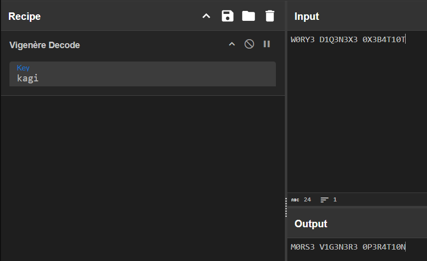

## Dots & Dashes

Japanese term for key is 'kagi'. 'kagi' is the key to your success.

Flag Format: EHAX{}, put underscores in place of spaces and use all lowercases.

[https://chall.ehax.tech/ehax-ctf-ehax25/Dots & Dashes/Audio.wav](https://chall.ehax.tech/ehax-ctf-ehax25/Dots%20&%20Dashes/Audio.wav)

モールス信号与えられるのでモールスデコードで検索した

https://morsecode.world/international/decoder/audio-decoder-adaptive.html

ここに.wavアップロードするとW0RY3 D1Q3N3X3 0X3B4T10Tと出てくる
keyは'kagi'なのでVigenere暗号をデコードする

### Flag
`EH4X{M0RS3_V1G3N3R3_0P3R4T10N}`