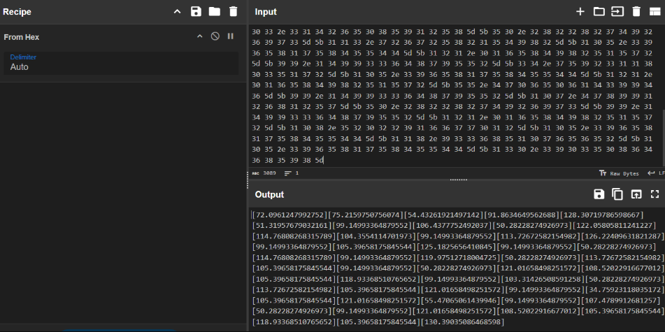

## Halley's Comet 1

My friend just went through a devastating breakup. Unable to cope, he vanished one night. Looking up at the night sky, I saw something extraordinary—a comet blazing across the heavens, but it wasn’t just any comet. Somehow, he was on it, searching for his lost love. The comet wasn’t following a typical path; its motion seemed deliberate, almost mathematical, as if it was tracing some secret cosmic equation.

At times, the comet would slow down, and I’d see a plume of red smoke rising from it. Each time this happened, I marked down the distance from Earth and the time. Was he trying to send me a message?

Help me find his ex.

[https://chall.ehax.tech/ehax-ctf-ehax25/Halley's Comet 1/distance.enc](https://chall.ehax.tech/ehax-ctf-ehax25/Halley's%20Comet%201/distance.enc)

distance.encをfrom HEXする
```
5b 37 32 2e 30 39 36 31 32 34 37 39 39 32 37 35 32 5d 5b 37 35 2e 32 31 35 39 37 35 30 37 35 36 30 37 34 5d 5b 35 34 2e 34 33 32 36 31 39 32 31 34 39 37 31 34 32 5d 5b 39 31 2e 38 36 33 34 36 34 39 35 36 32 36 38 38 5d 5b 31 32 38 2e 33 30 37 31 39 37 38 36 35 39 38 36 36 37 5d 5b 35 31 2e 33 31 39 35 37 36 37 39 30 33 32 31 36 31 5d 5b 39 39 2e 31 34 39 39 33 33 36 34 38 37 39 35 35 32 5d 5b 31 30 36 2e 34 33 37 37 37 35 32 34 39 32 30 33 37 5d 5b 35 30 2e 32 38 32 32 38 32 37 34 39 32 36 39 37 33 5d 5b 31 32 32 2e 30 35 38 30 35 38 31 31 32 34 31 32 32 37 5d 5b 31 31 34 2e 37 36 38 30 38 32 36 38 33 31 35 37 38 39 5d 5b 31 30 34 2e 33 35 35 34 31 31 34 37 30 31 39 37 33 5d 5b 39 39 2e 31 34 39 39 33 33 36 34 38 37 39 35 35 32 5d 5b 31 31 33 2e 37 32 36 37 32 35 38 32 31 35 34 39 38 32 5d 5b 31 32 36 2e 32 32 34 30 39 36 33 31 38 32 31 32 38 37 5d 5b 39 39 2e 31 34 39 39 33 33 36 34 38 37 39 35 35 32 5d 5b 31 30 35 2e 33 39 36 35 38 31 37 35 38 34 35 35 34 34 5d 5b 31 32 35 2e 31 38 32 35 36 35 36 34 31 30 38 34 35 5d 5b 39 39 2e 31 34 39 39 33 33 36 34 38 37 39 35 35 32 5d 5b 35 30 2e 32 38 32 32 38 32 37 34 39 32 36 39 37 33 5d 5b 31 31 34 2e 37 36 38 30 38 32 36 38 33 31 35 37 38 39 5d 5b 39 39 2e 31 34 39 39 33 33 36 34 38 37 39 35 35 32 5d 5b 31 31 39 2e 39 37 35 31 32 37 31 38 30 30 34 37 32 35 5d 5b 35 30 2e 32 38 32 32 38 32 37 34 39 32 36 39 37 33 5d 5b 31 31 33 2e 37 32 36 37 32 35 38 32 31 35 34 39 38 32 5d 5b 31 30 35 2e 33 39 36 35 38 31 37 35 38 34 35 35 34 34 5d 5b 39 39 2e 31 34 39 39 33 33 36 34 38 37 39 35 35 32 5d 5b 35 30 2e 32 38 32 32 38 32 37 34 39 32 36 39 37 33 5d 5b 31 32 31 2e 30 31 36 35 38 34 39 38 32 35 31 35 37 32 5d 5b 31 30 38 2e 35 32 30 32 32 39 31 36 36 37 37 30 31 32 5d 5b 31 30 35 2e 33 39 36 35 38 31 37 35 38 34 35 35 34 34 5d 5b 31 31 38 2e 39 33 33 36 38 35 31 30 37 36 35 36 35 32 5d 5b 39 39 2e 31 34 39 39 33 33 36 34 38 37 39 35 35 32 5d 5b 31 30 33 2e 33 31 34 32 36 35 30 38 35 39 31 32 35 38 5d 5b 35 30 2e 32 38 32 32 38 32 37 34 39 32 36 39 37 33 5d 5b 31 31 33 2e 37 32 36 37 32 35 38 32 31 35 34 39 38 32 5d 5b 31 30 35 2e 33 39 36 35 38 31 37 35 38 34 35 35 34 34 5d 5b 31 32 31 2e 30 31 36 35 38 34 39 38 32 35 31 35 37 32 5d 5b 39 39 2e 31 34 39 39 33 33 36 34 38 37 39 35 35 32 5d 5b 33 34 2e 37 35 39 32 33 31 31 38 30 33 35 31 37 32 5d 5b 31 30 35 2e 33 39 36 35 38 31 37 35 38 34 35 35 34 34 5d 5b 31 32 31 2e 30 31 36 35 38 34 39 38 32 35 31 35 37 32 5d 5b 35 35 2e 34 37 30 36 35 30 36 31 34 33 39 39 34 36 5d 5b 39 39 2e 31 34 39 39 33 33 36 34 38 37 39 35 35 32 5d 5b 31 30 37 2e 34 37 38 39 39 31 32 36 38 31 32 35 37 5d 5b 35 30 2e 32 38 32 32 38 32 37 34 39 32 36 39 37 33 5d 5b 39 39 2e 31 34 39 39 33 33 36 34 38 37 39 35 35 32 5d 5b 31 32 31 2e 30 31 36 35 38 34 39 38 32 35 31 35 37 32 5d 5b 31 30 38 2e 35 32 30 32 32 39 31 36 36 37 37 30 31 32 5d 5b 31 30 35 2e 33 39 36 35 38 31 37 35 38 34 35 35 34 34 5d 5b 31 31 38 2e 39 33 33 36 38 35 31 30 37 36 35 36 35 32 5d 5b 31 30 35 2e 33 39 36 35 38 31 37 35 38 34 35 35 34 34 5d 5b 31 33 30 2e 33 39 30 33 35 30 38 36 34 36 38 35 39 38 5d
```




from HEXした結果
`[72.0961247992752][75.2159750756074][54.43261921497142][91.8634649562688][128.30719786598667][51.31957679032161][99.14993364879552][106.4377752492037][50.28228274926973][122.05805811241227][114.76808268315789][104.3554114701973][99.14993364879552][113.72672582154982][126.22409631821287][99.14993364879552][105.39658175845544][125.1825656410845][99.14993364879552][50.28228274926973][114.76808268315789][99.14993364879552][119.97512718004725][50.28228274926973][113.72672582154982][105.39658175845544][99.14993364879552][50.28228274926973][121.01658498251572][108.52022916677012][105.39658175845544][118.93368510765652][99.14993364879552][103.31426508591258][50.28228274926973][113.72672582154982][105.39658175845544][121.01658498251572][99.14993364879552][34.75923118035172][105.39658175845544][121.01658498251572][55.47065061439946][99.14993364879552][107.4789912681257][50.28228274926973][99.14993364879552][121.01658498251572][108.52022916677012][105.39658175845544][118.93368510765652][105.39658175845544][130.39035086468598]`


solve.py
```
enc = [72.0961247992752, 75.2159750756074, 54.43261921497142, 91.8634649562688, 128.30719786598667, 51.31957679032161,
           99.14993364879552, 106.4377752492037, 50.28228274926973, 122.05805811241227, 114.76808268315789, 104.3554114701973,
           99.14993364879552, 113.72672582154982, 126.22409631821287, 99.14993364879552, 105.39658175845544, 125.1825656410845,
           99.14993364879552, 50.28228274926973, 114.76808268315789, 99.14993364879552, 119.97512718004725, 50.28228274926973,
           113.72672582154982, 105.39658175845544, 99.14993364879552, 50.28228274926973, 121.01658498251572, 108.52022916677012,
           105.39658175845544, 118.93368510765652, 99.14993364879552, 103.31426508591258, 50.28228274926973, 113.72672582154982,
           105.39658175845544, 121.01658498251572, 99.14993364879552, 34.75923118035172, 105.39658175845544, 121.01658498251572,
           55.47065061439946, 99.14993364879552, 107.4789912681257, 50.28228274926973, 99.14993364879552, 121.01658498251572,
           108.52022916677012, 105.39658175845544, 118.93368510765652, 105.39658175845544, 130.39035086468598]

flag = ""
for value in enc:
    int_value = int(value)
    adjusted_value = int_value - (int_value // 24)
    flag += chr(adjusted_value)

print(flag)

$ python3 a.py
EH4X{1_f0und_my_ex_0n_s0me_0ther_c0met_!et5_g0_there}
```

`EH4X{1_f0und_my_ex_0n_s0me_0ther_c0met_!et5_g0_there}`