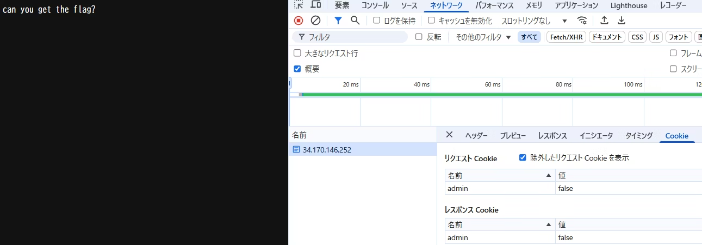
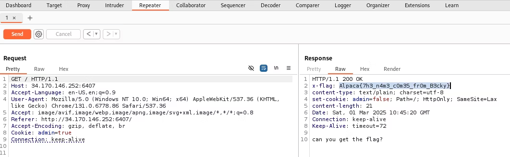

## 🍪

ある条件を満たすとフラグが得られるようです

```
import Fastify from "fastify";
import fastifyCookie from "@fastify/cookie";

const fastify = Fastify();
fastify.register(fastifyCookie);

fastify.get("/", async (req, reply) => {
  reply.setCookie('admin', 'false', { path: '/', httpOnly: true });
  if (req.cookies.admin === "true")
    reply.header("X-Flag", process.env.FLAG);
  return "can you get the flag?";
});

fastify.listen({ port: process.env.PORT, host: "0.0.0.0" });
http://34.170.146.252:6407
```
アクセスしてみる



admin === "true"にすればX-Flagが返ってくるらしいからburpで
`Cookie: admin=true‘にして送るとx-flagが返ってきた




### Flag
`Alpaca{7h3_n4m3_c0m35_fr0m_B3cky}`