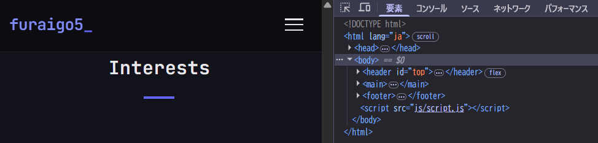
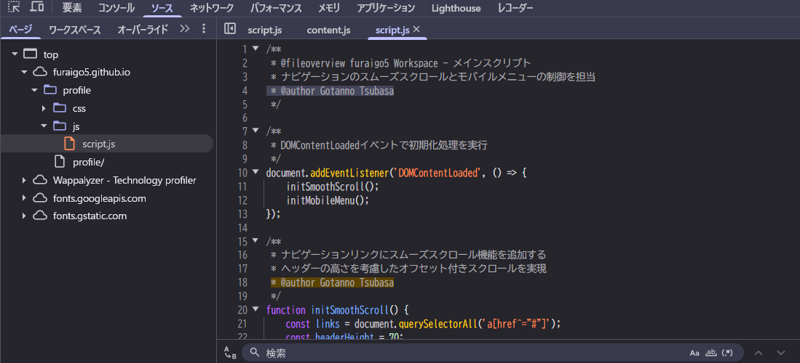

# debeyohiru_01_social

> 調査対象の人物はソフトウェアエンジニアで、2026年以降には debeyohiru というIDでの活動が確認されています。この人物がこのIDでの活動を開始したのは2026年1月のようです。この人物がこれ以前に使用していたIDを特定できないでしょうか？2026年1月時点で、noteというサービスに古いIDのアカウントが残存しているようです。このアカウントのIDを解答してください。例えば、digital_jpn_gc が対象のアカウントの場合、 Flag は SWIMMER{digital_jpn_gc} となります。

## flag

SWIMMER{furaigo5}

# debeyohiru_02_profile

> debeyohiru は2026年1月時点で求職中で、プロフィールページをウェブ上に公開していたようです。このページを探り出し、そのURLを解答してください。

例えば、 https://example.com/foobar が対象のページの場合、 Flagは SWIMMER{https://example.com/foobar} となります。

## solution

https://whatsmyname.me/

Githubアカウントが見つかります。

https://github.com/furaigo5

プロフィールリンクがあるので、それです。

## flag

SWIMMER{https://furaigo5.github.io/profile/}

# debeyohiru_03_email

>debeyohiru が2026年現在、普段使っているメールアドレスが知りたいです。この人物が現在使用中とおぼしきメールアドレスを探り出し、解答してください。例えば、メールアドレスがfoobar@example.comの場合、Flagは SWIMMER{foobar@example.com} となります。警告: このアドレスに対してメールを送信してはなりません。解答に際して、メールを送る必要は一切ありません。

## soluiton

Githubにあったプロフィールページに書いてあります。

https://bsky.app/profile/debeyohiru.bsky.social

## flag

SWIMMER{furaigo5.onionsoup@gmail.com}

# debeyohiru_05_hidden1

> debeyohiru の本名が知りたいです。この人物の実名と考えられるものを解答してください。 ローマ字（アルファベット）表記で入力してください。漢字の表記を考慮する必要はありません。例えば、Sanae Takaichiが実名の場合、Flagは SWIMMER{Sanae Takaichi} となります。

## solution

daデベロッパーツールで見てみると、js/script.jsがあるっぽいので確認するとみrつかる

## flag

SWIMMER{Gotanno Tsubasa}

# debeyohiru_05_hidden2

>debeyohiru が 2025年12月 時点で使用していたと考えられるスマートフォンの機種が知りたいです。なお、複数の端末を使用していたと考えられる場合は、アンダーバー（_）で繋いで全てを解答してください。この場合、回答順序は問いません。また、メーカー名は不要です。例えば、Xperia 10 VIIとiPhone 17を使用していた場合、 Flagは SWIMMER{Xperia 10 VII_iPhone 17} となります。

## solution

Webアーカイブの検索で確認する

https://archive.is/ORR6S
