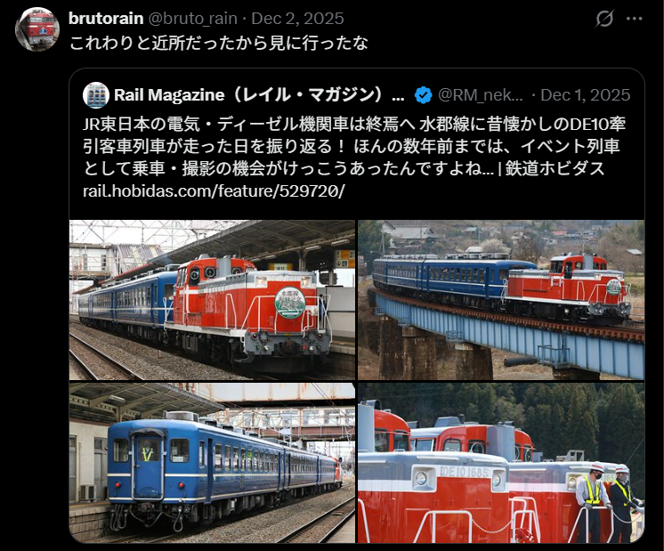
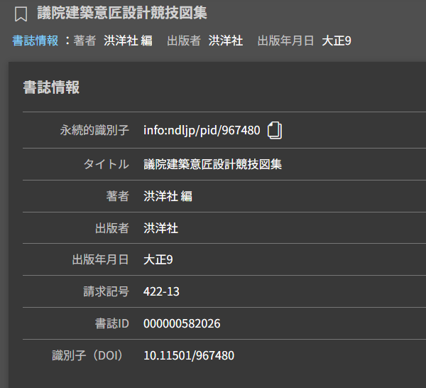
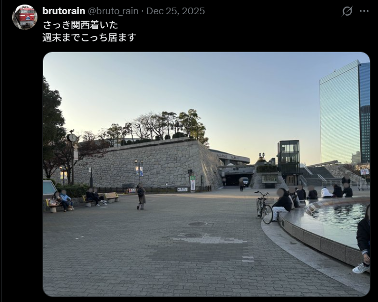

# rain_01_social

> rain は2026年時点でXのアカウントを所持していたようです。我々は、この人物の投稿のスクリーンショットを入手しました。スクリーンショットからアカウントを特定し、このアカウントのID（スクリーンネーム）を解答してください。例えば、@gov_online が対象のアカウントの場合、Flag は SWIMMER{@gov_online} となります。

https://x.com/bruto_rain

## flag

SWIMMER{@bruto_rain}

# rain_04_source2

> rain が2番目に作成した偽記事には、「rainが未公開の情報を見つけた」ということが書かれているようです。しかし、これは虚偽だと思われます。この人物の嘘を暴くには、正確な出典を探す必要があります。この画像の出典となる古い書籍は電子化されており、詳細が参照できるはずです。その資料のデジタルオブジェクト識別子（DOI）を解答してください。例えば、答えが 12.34567/890123 の場合、Flagは SWIMMER{12.34567/890123} となります。

## solution

https://brutorain.wordpress.com/2025/12/21/%e8%aa%b0%e3%82%82%e7%9f%a5%e3%82%89%e3%81%aa%e3%81%84%e7%9c%9f%e5%ae%9f%e3%82%92%e7%99%ba%e8%a6%8b/

画像は、日本の国会議事堂の建築設計競技に渡辺福三が提出した設計案の図版です。
国立国会図書館デジタルコレクションで、議院建築意匠設計競技図集を検索

https://dl.ndl.go.jp/pid/967480

## flag

SWIMMER{10.11501/967480}

# rain_05_date

> rain は2025年12月25日 (JST)、ある場所に来たことをX上で投稿しています。しかし、この画像は2025年の別の日に撮影された写真のようで、事実とは異なるようです。 この写真が本当に撮影された日を YYYY/MM/DD の形式で解答してください。ただし、撮影日は日本時間（JST）を基準とします。 例えば、答えが2025年6月8日の場合、Flagは SWIMMER{2025/06/08} となります。

## solution

https://x.com/bruto_rain/status/2004085702469075019?s=20

大阪城ホールの写真です

拡大すると看板があります。文字起こしすると「SUNTORY 10000 Freude（サントリー 1万人の第九）」と書かれています

「大阪城ホール イベント SUNTORY 10000 Freude（サントリー 1万人の第九）」で検索すると以下のリンクがヒットし、イベント日が書かれているのでそれがFlagです。

https://www.suntory.co.jp/culture-sports/daiku/

## flag

SWIMMER{2025/12/07}