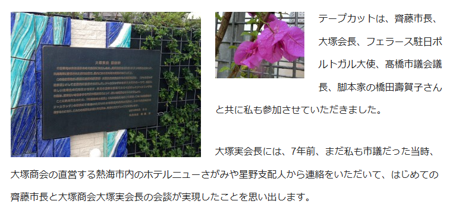
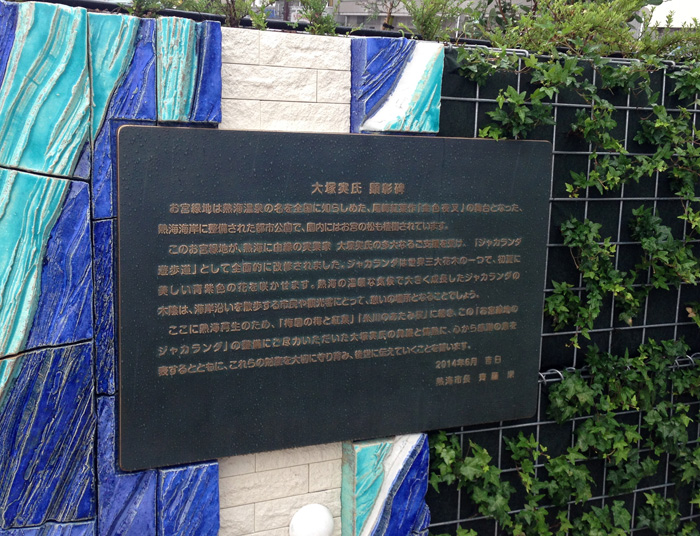

# Casca

海が綺麗なこの日本の街は、かつてポルトガルのリゾート地との交流がありました。
この写真のすぐ右側にはその記念碑が置かれています。記念碑に書かれている「式典の開催日」を答えてください。
Format: TsukuCTF25{YYYY/MM/DD}

## solution

文章検索すると、海が綺麗な日本の街で、かつてポルトガルのリゾート地と交流があったのは、熱海市を判明する
ポルトガルのカスカイス市と姉妹都市提携を結んでいる

画像検索する

https://hashikazu.org/archives/12598

この記事には以下のようなことが書かれていた
平成26年6月6日（金）午前11時から熱海市東海岸町のお宮緑地にて「お宮緑地・ジャカランダ遊歩道」の完成式典が開催されました。

拡大すると、2014年6月吉日と書かれている

## flag

`TsukuCTF25{2014/06/06}`