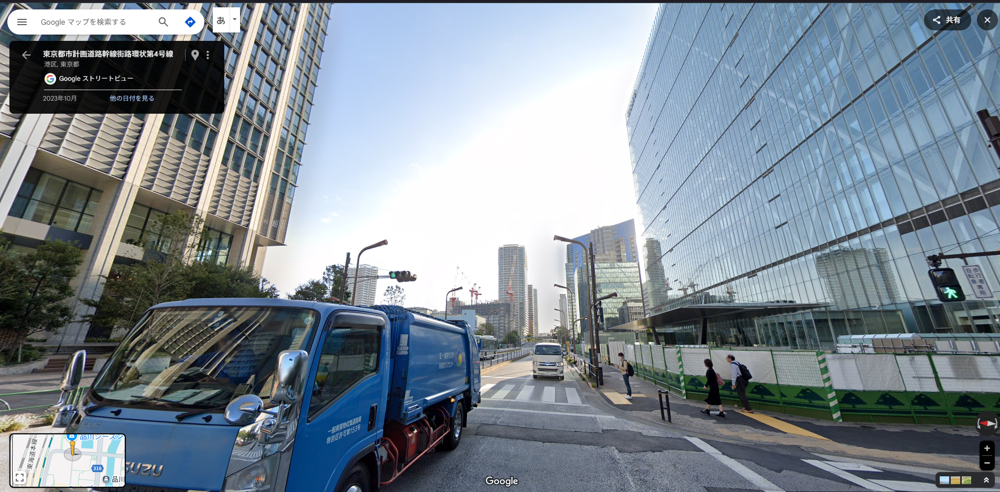

# buildings

あの建物が建ったら、また空が狭くなるんだろうな。
フラグフォーマットはこの人が立っている場所のTsukuCTF25{緯度_経度}です。ただし、緯度および経度は小数点以下五桁目を切り捨てたものとします。

## solution

この雰囲気は、品川！
画像検索すると中央の高い建物がロイヤルパークス品川らしいのでgooglemapで見てみるを場所見つけた

https://www.google.co.jp/maps/@35.631826,139.7431603,3a,75y,83.08h,94.8t/data=!3m10!1e1!3m8!1s-qpbqSSongjQPJPTrLV8Ag!2e0!6shttps:%2F%2Fstreetviewpixels-pa.googleapis.com%2Fv1%2Fthumbnail%3Fcb_client%3Dmaps_sv.tactile%26w%3D900%26h%3D600%26pitch%3D-4.797395733500068%26panoid%3D-qpbqSSongjQPJPTrLV8Ag%26yaw%3D83.08150538607401!7i16384!8i8192!9m2!1b1!2i38?entry=ttu&g_ep=EgoyMDI1MDQzMC4xIKXMDSoASAFQAw%3D%3D

## flag

`TsukuCTF25{35.6872_139.7627}`