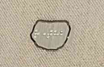
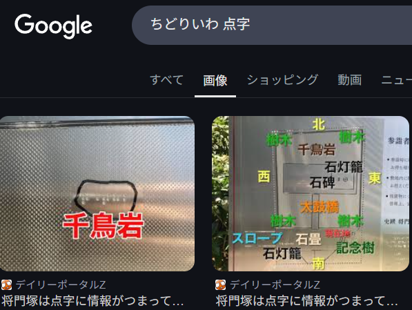
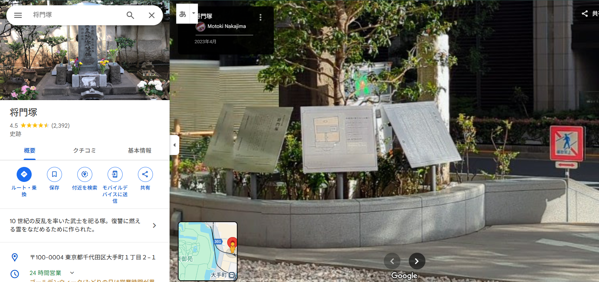

# power

力を感じてきた。
フラグフォーマットはこの人が立っている場所のTsukuCTF25{緯度_経度}です。ただし、緯度および経度は小数点以下五桁目を切り捨てたものとします。

拡大して点字が書かれているので読み解くと、ちどりいわ　という単語が出てくる

将門塚というキーワードが出てきたのでgooglemapで見てみると似たような看板があった

https://www.google.co.jp/maps/place/%E5%B0%86%E9%96%80%E5%A1%9A/@35.6873169,139.760166,17z/data=!3m1!4b1!4m6!3m5!1s0x60188c0629eba0bb:0xc778770081e92da0!8m2!3d35.6873126!4d139.7627409!16s%2Fg%2F1224bstc?entry=ttu&g_ep=EgoyMDI1MDQzMC4xIKXMDSoASAFQAw%3D%3D

## flag

`TsukuCTF25{35.6873_139.7627}`