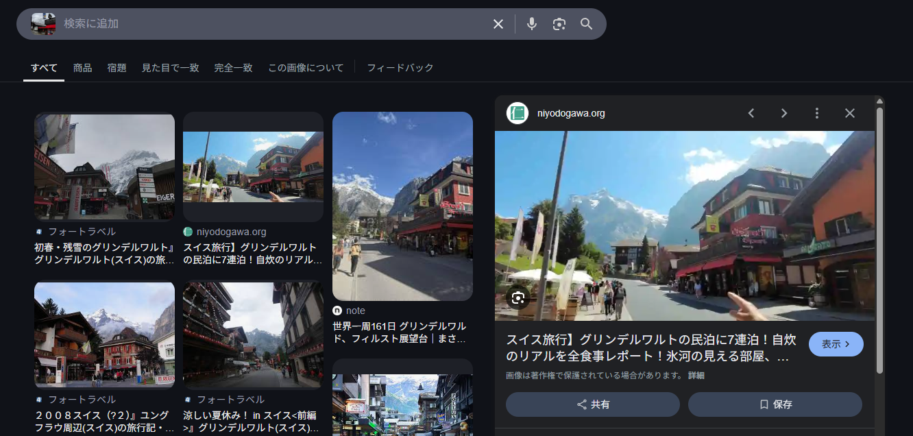
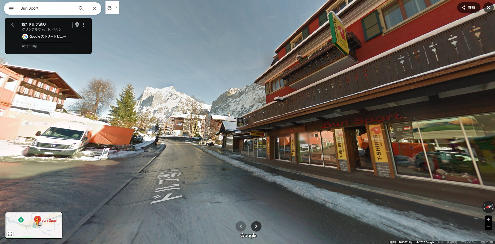

# schnee

素敵な雪山に辿り着いた！スノーボードをレンタルをして、いざ滑走！
フラグフォーマットは写真の場所の座標の小数点第4位を四捨五入して、小数第3位までをTsukuCTF25{緯度_経度}の形式で記載してください。
例: TsukuCTF25{12.345_123.456}

## solution

画像検索入れるとスイスのグリンデルワルトという場所が出てくる
似たようなお店があり、Buri Sportというお店と分かる

ストリートビューで見てみると一致する

座標は以下です
46.62351015734549, 8.040012543107746

## flag

`TsukuCTF25{46.624_8.040}`