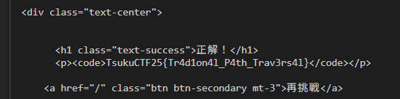

# flash

3, 2, 1, pop!
http://challs.tsukuctf.org:50000/

## solution

フラッシュ暗算に正解できるとFlagが出てくるっぽいけど、途中の数値が表示されない

セッションで管理されていて正解じゃない解答を入力しても正解の数値がわかる
正解の数値を確認していつ前の段階に戻って再度入力すれば行けそう

出力

## flag

`TsukuCTF25{Tr4d1on4l_P4th_Trav3rs4l}`