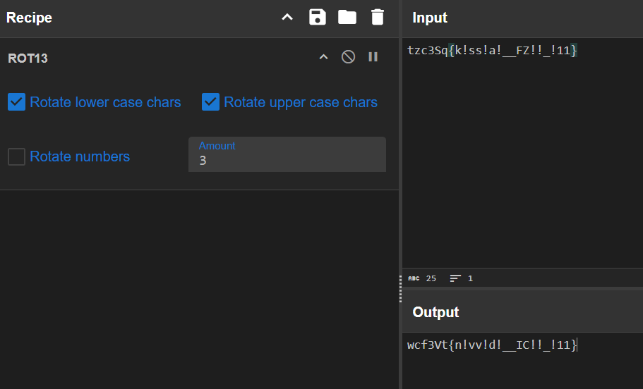

# EtTuCaesar - Crypto

Caesar has left a you a note encrypted with his favorite cipher, but he seems to have jumbled things even further. Can you restore his message?
What if I put the note in the shape of a square?


与えられたもの
`tzc3Sq{k!ss!a!__FZ!!_!11}`


## solve


ROTで3にすると`wcf3Vt{n!vv!d!__IC!!_!11}`が現れる



5文字ずつに並べると正方形になる、左上から斜めに↙このように読むと分かる
```
wcf3V
t{n!v
v!d!_
_IC!!
_!11}
```

## flag
`wctf{v3n!_V!dI_v!C!_1!1}`