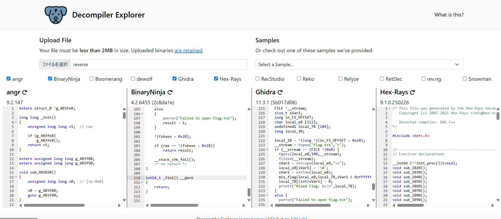

# REverse

I hate when when RE challenges just make me do something backwards...

解凍する
```
┌──(kali㉿kali)-[/media/sf_vm_share/ctf/WolvCTF_2025/Beginner]
└─$ tar -xzvf dist.tar.gz
reverse
out.txt
                                                                                                                    
┌──(kali㉿kali)-[/media/sf_vm_share/ctf/WolvCTF_2025/Beginner]
└─$ ls
dist.tar.gz  out.txt  reverse
                                                                                                                    
┌──(kali㉿kali)-[/media/sf_vm_share/ctf/WolvCTF_2025/Beginner]
└─$ cat out.txt 
Mixed Flag: t`qcxo0s0o2.kd\.k\o0s0o20z
                                                                                                                    
┌──(kali㉿kali)-[/media/sf_vm_share/ctf/WolvCTF_2025/Beginner]
└─$ cat reverse 
@@@@�▒▒▒��   DD�-�=�=���-�=�=�8880hhhDDS
```

https://dogbolt.org/
このサイトでreverseデコンパイルすると



- Mixed Flag: t`qcxo0s0o2.kd\.k\o0s0o20z
- 与えられた文字列（flag.txtから読み取ったデータ）に対して「文字のシフト」と「文字の入れ替え」を行う処理が行われているっぽい


## solve
シーザー暗号の総当たり攻撃のスクリプト書いて実行するとShift 92でflagゲットできた

GPTが書いたスクリプトは以下
>シーザー暗号では、文字をシフトして暗号化します。例えば、'A'を1シフトすると'B'になります。
上記のコードでは、総当たりでシーザー暗号の復号化を行いました。これは、暗号化されているテキストを1シフトから94シフトまで順番に試して、どれが正しいフラグを返すか確認する方法です。
シフトの範囲は、通常のシーザー暗号において、ASCIIコードで表示可能な文字（32〜126）のシフトで行いました。シフト範囲は通常1〜94です。

```
def caesar_decrypt(ciphertext, shift):
    # シーザー暗号の復号化（指定したシフト分）
    decrypted_text = ''.join(
        [chr(((ord(c) - 32 - shift) % 95) + 32) if 32 <= ord(c) <= 126 else c for c in ciphertext]
    )
    return decrypted_text

def brute_force_caesar(ciphertext):
    # すべてのシフトを試して復号化
    for shift in range(1, 95):  # 1から94までのシフトを試す（ASCII 32〜126の範囲）
        decrypted = caesar_decrypt(ciphertext, shift)
        print(f"Shift {shift}: {decrypted}")

# 混ぜ合わせたフラグ（例: "t`qcxo0s0o2.kd\\.k\\o0s0o20z"）
ciphertext = "t`qcxo0s0o2.kd\\.k\\o0s0o20z"

# 総当たり
brute_force_caesar(ciphertext)
```

出力
```
Shift 88: {gxj v7z7v95rkc5rcv7z7v97"
Shift 89: zfwi~u6y6u84qjb4qbu6y6u86!
Shift 90: yevh}t5x5t73pia3pat5x5t75 
Shift 91: xdug|s4w4s62oh`2o`s4w4s64~
Shift 92: wctf{r3v3r51ng_1n_r3v3r53}
Shift 93: vbsezq2u2q40mf^0m^q2u2q42|
Shift 94: uardyp1t1p3/le]/l]p1t1p31{
```

## flag
`wctf{r3v3r51ng_1n_r3v3r53}`