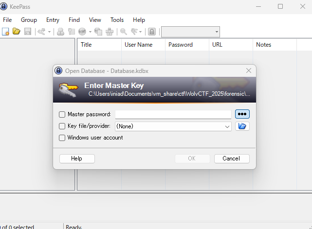
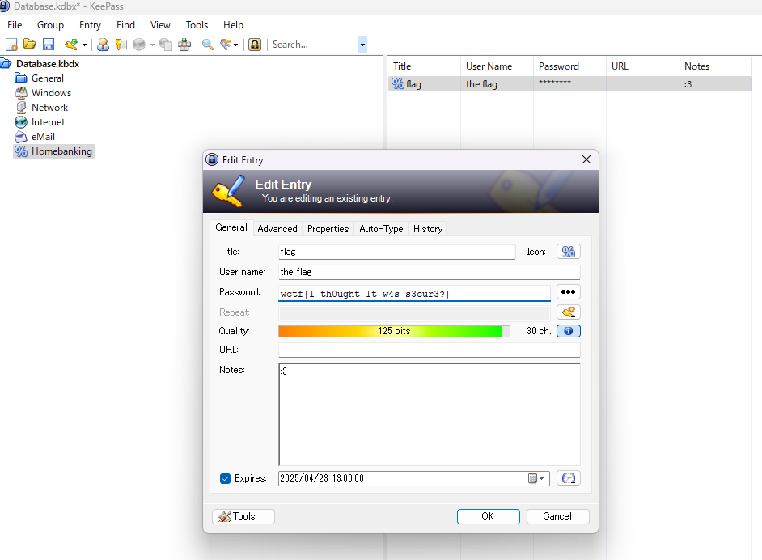

# Passwords

I heard you're a hacker. Can you help me get my passwords back?


database.kdbxというファイルが与えられる

## solve
タイトルのpasswordから察しの通りjohn使ってパスワードを求める

```
┌──(kali㉿kali)-[/media/sf_vm_share/ctf/WolvCTF_2025/forensic]
└─$ john database.hash
Using default input encoding: UTF-8
Loaded 1 password hash (KeePass [SHA256 AES 32/64])
Cost 1 (iteration count) is 6000 for all loaded hashes
Cost 2 (version) is 2 for all loaded hashes
Cost 3 (algorithm [0=AES 1=TwoFish 2=ChaCha]) is 0 for all loaded hashes
Will run 2 OpenMP threads
Proceeding with single, rules:Single
Press 'q' or Ctrl-C to abort, almost any other key for status
Warning: Only 6 candidates buffered for the current salt, minimum 8 needed for performance.
Almost done: Processing the remaining buffered candidate passwords, if any.
Proceeding with wordlist:/usr/share/john/password.lst
goblue1          (Database)     
1g 0:00:00:13 DONE 2/3 (2025-03-23 13:16) 0.07246g/s 886.8p/s 886.8c/s 886.8C/s goblue1..gustavo1
Use the "--show" option to display all of the cracked passwords reliably
Session completed. 
```
`goblue1`と分かった


- .kdbxの開き方について検索する
KeePass（キーパス）は、パスワードの管理と保護を目的としたフリーでオープンソースのソフトウェア

- ここからKeePassをインストールする
https://keepass.info/download.html

インストール完了して、ファイルを開くから与えられたモノを開くとパスワードを求められるので`goblue1`でいけた




HomeBankingの所にflagを発見



## flag
`wctf{1_th0ught_1t_w4s_s3cur3?}`