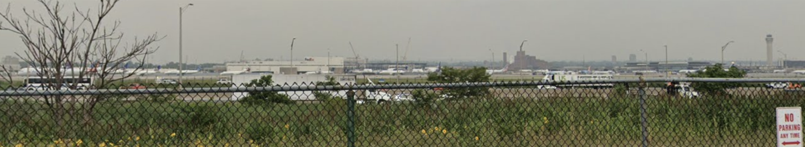

# Lost

I need your help. My friend Jimmy has absolutely zero sense of direction and may or may not have gotten himself lost. Like, super duper lost. All I know is his flight should’ve taken off from somewhere in the US at 12:59 PM on March 17th, and this picture that he sent me. Can you tell me what flight he is on? (Flag format: wctf{XX####}, use IATA airline code)

わかること

- 空港
- タワーがある
- 大きなFedExの建物がある
- FedExの建物の横に道路みたいなものがある

3月7日午後1時26分/1時27分 (東部標準時)、その時間にEWRを出発したのはUA2050便

##　flag
`wctf{UA2050}`