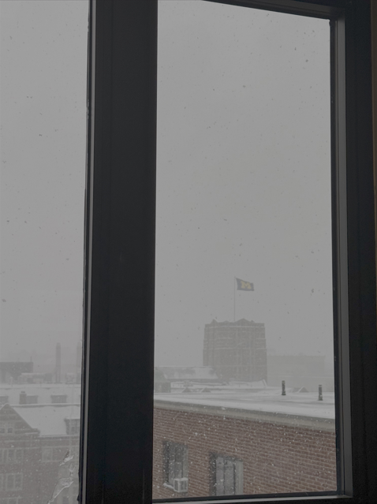

# Wintery

As the snow has once again started to fall, I spotted a flag afar. Can you find where this picture was taken? Truncate your coordinates to 3 decimal places.

Flag format: wctf{latitude,longitude}

写真からわかる以下の情報をもとにGoogleMapで探す

- Michigan Unionの旗
- 右下に屋根がある

South Quadrangleが当てはまると分かる

## flag
wctf{42.27386,-83.74194}