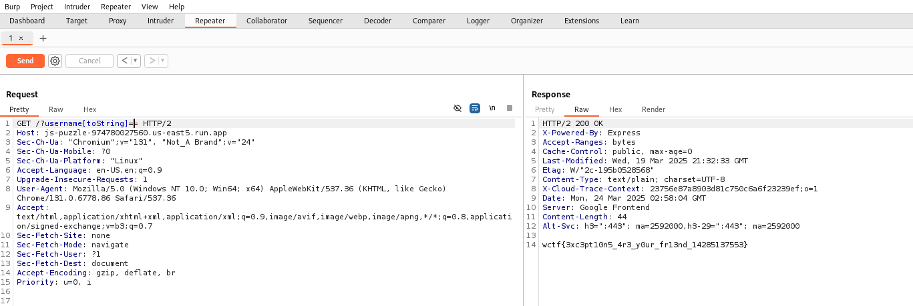

# Javascript Puzzle


It is often useful to force exceptions to potentially get back valuable information.
Can you make a request which causes an exception in this app?
https://js-puzzle-974780027560.us-east5.run.app

@author: SamXML


```
┌──(kali㉿kali)-[/media/sf_vm_share/ctf/WolvCTF_2025/web]
└─$ tar -xzvf dist.tar.gz
./
./Dockerfile
./flag.txt
./package-lock.json
./package.json
./docker-compose.yml
./app.js
```


app.js見てみる
```
const express = require('express')

const app = express()
const port = 8000

app.get('/', (req, res) => {
    try {
        const username = req.query.username || 'Guest'
        const output = 'Hello ' + username
        res.send(output)
    }
    catch (error) {
        res.sendFile(__dirname + '/flag.txt')
    }
})

app.listen(port, () => {
    console.log(`Server is running at http://localhost:${port}`)
})
```
- try-catchブロック内でerrorが発生すると/flag.txtを送信される
- catch内でres.sendFile(__dirname + '/flag.txt') を実行するため、例外を発生させるとフラグを取得できる可能性がある


## solve

- usernameに特殊な値を渡し、try内でエラーを発生させる
- toStringでエラーを起こす


burpで`/?username[toString]=`を送るとflagが返ってきた




## flag
`wctf{3xc3pt10n5_4r3_y0ur_fr13nd_14285137553}`